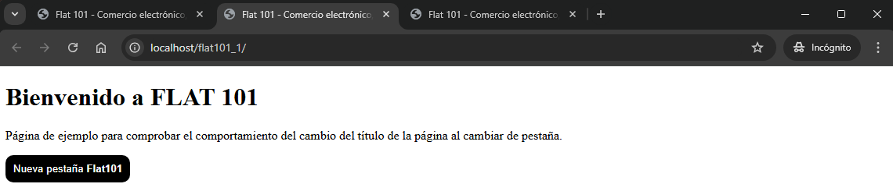
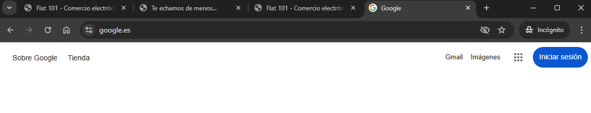
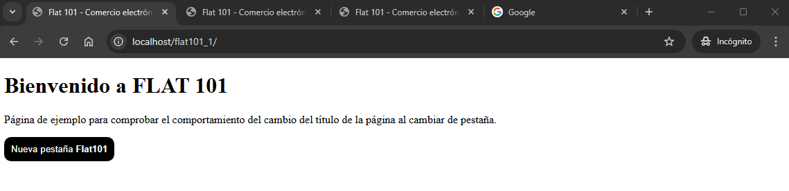
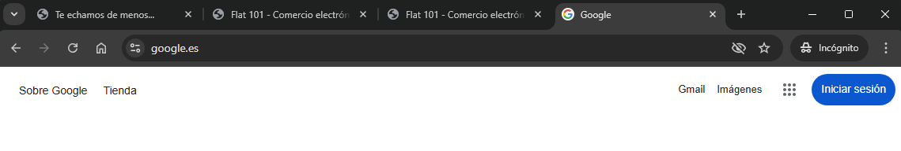

# FLAT101_1

When you are on a page and you change tabs in the browser, the page title should change to "Te echamos de menos...", and when you return to the tab, the original title should be restored.

We open a window.

We can add a new tab manually or by clicking the button to launch a new tab.

We added another tab for better verification.

We change tabs to check that the title does not change while on the same page.

We open a new tab in Google (for example) and check that the last active tab in flat101 is the one that changes its title.

We return to flat101 and the title is reset to the original.

We go back to another tab outside of flat101 and the title of the last active tab in flat101 is changed again.

## Authors

- [@ertatto24](https://github.com/ertatto24)
