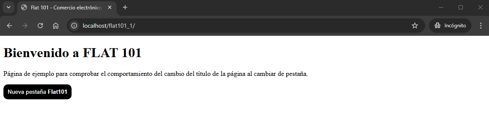
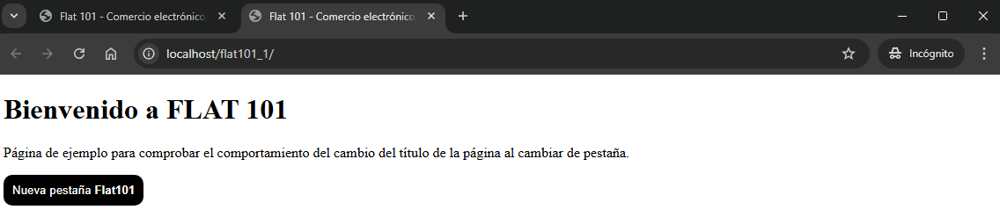

# FLAT101_1

When you are on a page and you change tabs in the browser, the page title should change to "Te echamos de menos...", and when you return to the tab, the original title should be restored.

We open a window.

We can add a new tab manually or by clicking the button to launch a new tab. When the new tab is opened and active, the original page changes its title.

When we return to the original page, the title is restored.

## Authors

- [@ertatto24](https://github.com/ertatto24)
